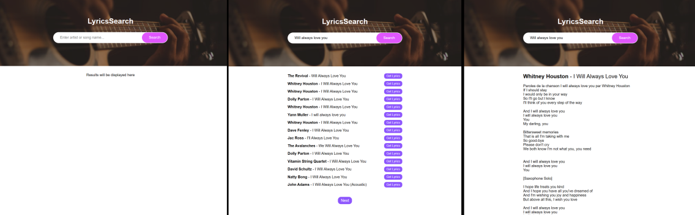
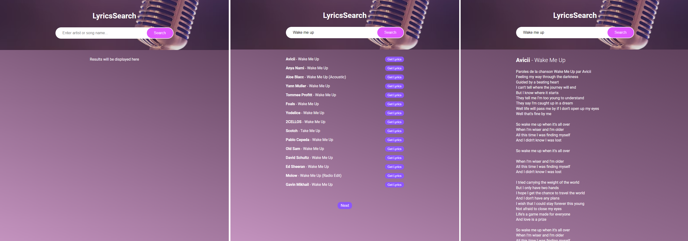

# Udemy--vanillawebprojects-15

**The fifteenth** in a series of **20 small projects** in **Vanilla JavaScript** from the [**Udemy course**](https://www.udemy.com/course/web-projects-with-vanilla-javascript/) by author [Brad Traversy](https://www.traversymedia.com/) with this [Brad's original GitHub repository](https://github.com/bradtraversy/vanillawebprojects).

# 15: LyricsSearch App

Find songs, artists and lyrics using the [lyrics.ovh](https://lyrics.ovh/) API

## Project Specifications

- Display UI with song/artist input
- Fetch songs/artists and put in DOM
- Add pagination
- Add get lyrics functionality and display in DOM

## Original preview

    

<!--
## My solution preview

 

    

## My solution features

- same as an original --> -->

# Author

Website - [Petr Bednarski](https://github.com/pettik)  
Frontend Mentor - [@pettik](https://www.frontendmentor.io/profile/pettik)
